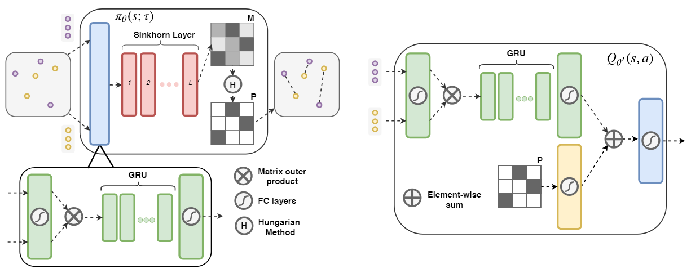

# sinkhorn-policy-gradient.pytorch

This repository contains code accompanying [Learning Permutations with Sinkhorn Policy Gradient](TODO) that can be used to replicate the experiments for sorting with N={20,50}, maximum weight matching with N={10,15,20,25}, and the Euclidean TSP with N=20. 

## What is Sinkhorn Policy Gradient? 

SPG is an off-policy actor-critic deterministic policy gradient algorithm. It can be used to train the SPG+Matching and SPG+Sequential deep network architectures from the paper to solve combinatorial optimization problems involving permutations. 



## Dependencies

* [PyTorch](https://pytorch.org)
    * Tested with versions 0.2 with cuda80 and 0.3.1 with cuda90
* h5py
* tqdm
* tensorboard_logger
* pathos
* scikit-learn (0.19.1)

## Data

Download the data used for all experiments in the paper [here](https://www.dropbox.com/sh/voi1jsqz6sj7vle/AAA97tcZwRITrEm67r3OFSYea?dl=0).
Create a directory called `data` in the base directory of the repo, and unzip the three zip files there.

## Running the experiments

To run an experiment, modify the arguments in the `run_spg.sh` file. I prefer this format as an extra layer over `argparse` so you don't have to deal with long lists of command line arguments. I will briefly explain the variables here:

* `N_NODES` Sets the problem size.
* `ACTOR_WORKERS` The number of cores to split the batch of problem instances across for parallel Hungarian method.
* `COP` The **C**ombinatorial **O**ptimization **P**roblem. Choose from {mwm2D_$N_NODES, sort_0-19, sort_0-49, tsp_$N_NODES}.
* `ARCH` Choose from {sequential, matching}.
* `RANDOM_SEED` Passed as CLI argument to `run_spg.sh`, e.g, `./run_spg.sh 1234`.
* `RUN_NUM` Passed as CLI argument to `run_spg.sh`, e.g., `./run_spg.sh 1234 -1`.
* `PARALLEL_ENVS` Number of problem instances to use in each forward pass.
* `BATCH_SIZE` Number of problem instances to use in each backwards pass.
* `N_FEATURES` Feature dimension of problem instance.
* `N_EPOCHS` Number of passes of the training set.
* `DISABLE_TENSORBOARD` Don't log tensorboard outfile.
* `EMBEDDING_DIM` The embedding layer dimension.
* `RNN_DIM` Hidden layer dim for the GRU. Automatically doubled for the bidirectional GRU in SPG+Sequential.
* `CUDA_DEVICE` Set the GPU device ID, default is 0.
* `REPLAY_BUFFER_GPU` Store the replay buffer on the GPU or on the CPU (requires passing more tensors back and forth but can use system RAM).
* `SAVE_STATS` Store rewards to a h5py file and store test scores to a json file for [FGLab](https://kaixhin.github.io/FGLab/).
* `SAVE_MODEL` Save model weights after each epoch.
* `BASE_DIR` The directory where logs, models, fglab results, etc. will be saved.

I have `--_id` set up with argparse for [FGMachine](https://github.com/Kaixhin/FGMachine).

## Licensing

Please read and respect the license :)

## Citations

Use this citation for the paper: 

```
TODO
```

If you use or modify this code for your work, please use the following citation:

```
@misc{emami2018spg,
  title = {{sinkhorn-policy-gradient.pytorch}}, 
  author = {Emami, Patrick and Ranka, Sanjay},
  howpublished = {\url{https://github.com/pemami4911/sinkhorn-policy-gradient.pytorch}},
  note = {Accessed: [Insert date here]}
}
```
